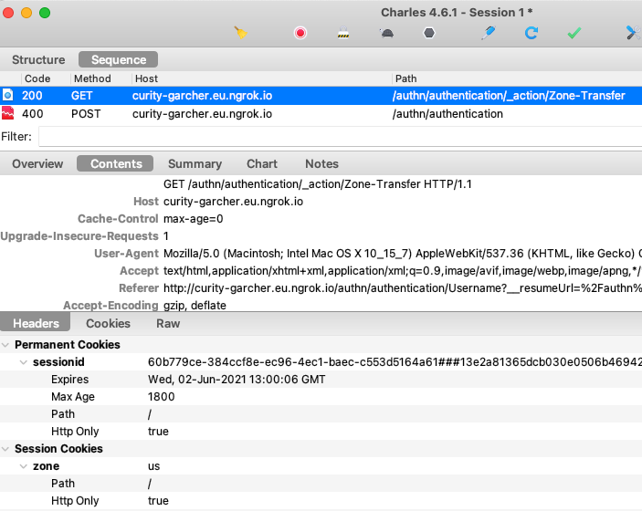
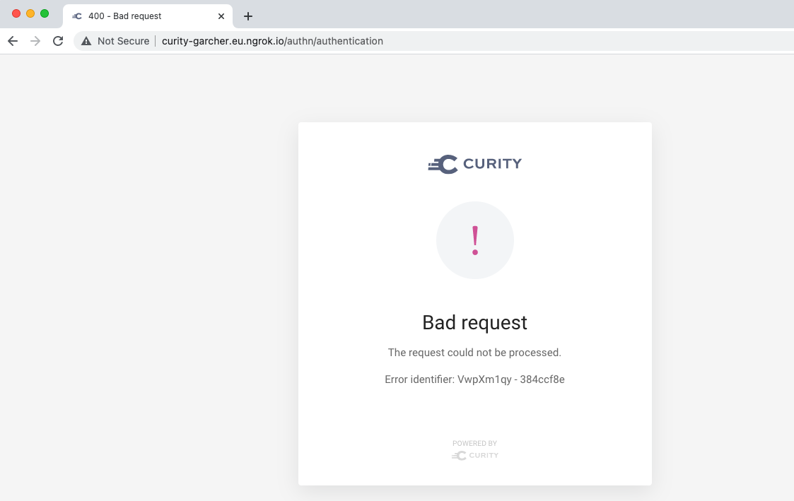

ZONE TRANSFER ACTION
--------------------
Log in as testuser.eu and then testuser.us (or vice versa).\
This triggers the Zone Transfer action and a zone cookie is set as in the below trace:

However, I then receive the following error, with no error information in logs:

ZONES AND SERVICE ROLE ERROR REPORTING
--------------------------------------
When a zone is not associated to a service role an authentication error occurs.\
It would be good to ensure that an error entry exists in logs in this case.

ARE COOKIES GETTING DROPPED?
----------------------------
I would expect multiple login attempts from OAuth tools to use the SSO cookie.\
However, I get prompted to login every time and would like to understand this better.\
Is this something to do with how I am running NGINX in front of the Identity Server?\
I have verified that I can POST HTTP requests through NGINX to a small NodeJS App.